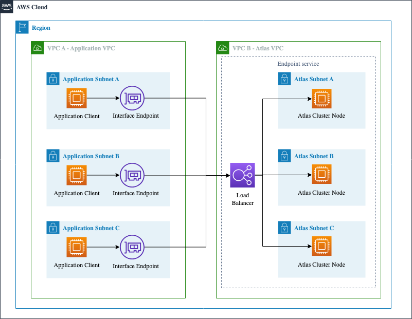

## AWS Privatelink for MongoDB Atlas PoC

### Introduction
This Proof of Concept (PoC) demonstrates the integration of MongoDB Atlas with AWS PrivateLink. This setup provides a secure, private connection to MongoDB Atlas from an AWS VPC, leveraging AWS PrivateLink technology.


### Why AWS PrivateLink for MongoDB Atlas?
AWS PrivateLink offers a private connectivity solution between AWS services and on-premises networks. It is particularly beneficial in scenarios where data security and network performance are paramount. Unlike traditional methods, such as public endpoints or VPC peering, PrivateLink provides a more secure and scalable approach. It does so by ensuring that the traffic between AWS and MongoDB Atlas does not traverse the public internet, thus reducing exposure to potential threats.

### When to Use AWS PrivateLink over VPC Peering?
AWS PrivateLink is recommended over VPC peering in scenarios where:

* Enhanced security and privacy are critical.
* There is a need to connect multiple VPCs to MongoDB Atlas without complex routing or overlapping IP issues.
* The architecture demands consistent low-latency connectivity.
* The organization prefers a streamlined network management process with less overhead.

## Architecture




## Deployment


#### Prerequisites

- AWS Account
- MongoDB Atlas Account
- Terraform


To deploy this PoC, follow these steps:

1. Initialize Terraform by running the following command:

```sh
terraform init
```

2. Review the changes that Terraform will apply by running the following command:

```sh
terraform plan
```

3. Deploy the PoC by running the following command:

```sh
terraform apply -auto-approve
```
